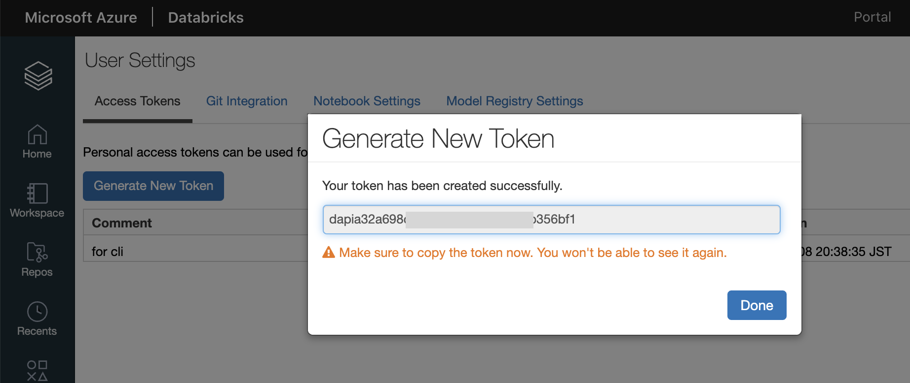

外部ツールからのDelta Lake利用(ODBC連携)
=========

DatabricksのDelta Lake上にあるデータを利用する場合、ODBC/JDBCによる連携を利用します。
この例では、Linuxマシン上(Ubuntu20.04, Databricks外部)にある`pandas`のコードでDelta Lake上のデータを参照する
方法を見ていきます。


1. 環境構築(Databerick ODBCドライバのインスール)
--------------

最初にDatabricks ODBCドライバを[公式サイト](https://databricks.com/spark/odbc-drivers-download)からダウンロードしてインストールします。
使用する環境に合わせてドライバーを選択してください。
今回の例ではUbuntuを使用するので、`Linux (deb)`をダウンロードし、`apt`でインストールします。

```bash
$ wget https://databricks-bi-artifacts.s3.us-east-2.amazonaws.com/simbaspark-drivers/odbc/2.6.16/SimbaSparkODBC-2.6.16.1019-Debian-64bit.zip

$ unzip SimbaSparkODBC-2.6.16.1019-Debian-64bit.zip 

$ sudo apt install ./simbaspark_2.6.16.1019-2_amd64.deb
```

2. ODBCライブラリのインストール
----------

続いて、pandasからODBCを利用するためのライブラリ(`pyodbc`)をインスールします。

```bash
$ sudo apt update
$ sudo apt install  unixodbc unixodbc-dev

$ pip install pyodbc
```

続いて、ODBCの環境設定を行います。
ODBCの接続のための情報はDatabricksのCluster管理画面(SQL Analyticsの場合はEndpoint管理画面)から確認できます。


また、接続のための認証としてUserのAccess Tokenが必要になります。
Tokenを作成するにはDatabrciksのワークスペース右上にあるユーザー設定アイコンから`User Settings`をクリックします。
その後、`Access Token`タブ内にある`Generate New Token`からトークンを発行します。




上記で確認した接続情報に基づいて、以下の2つのファイルを設定します。

`/etc/odbc.ini`
```
[ODBC Data Sources]
Databricks-Spark = Simba

[Databricks-Spark]
Driver=Simba
Server=japan-sa.cloud.databricks.com
HOST=japan-sa.cloud.databricks.com
PORT=443
SparkServerType=3
Schema=default
ThriftTransport=2
SSL=1
AuthMech=3
UID=token
PWD=dapi5165xxxxxxxxxxxxxx54f1e54bebec <=アクセストークン
HTTPPath=sql/protocolv1/o/3762993952398646/0430-081806-waled253
```

`/etc/odbcinst.ini`
```
[ODBC Drivers]
Simba = Installed

[Simba]
Driver = /opt/simba/spark/lib/64/libsparkodbc_sb64.so
```


3. PandasからDelta Lake上のデータを参照する
----------

最後にpandasからDatabrciks Delta Lake上にあるデータ(テーブル)を参照します。
(すでにDatabeicks Delta Lake上に`db=default`、`table=diamonds`が作成されている前提)

サンプルコード(`odbc-example.py`)
```python
# import the `pyodbc` package:
import pyodbc
import pandas as pd

# establish a connection using the DSN you created earlier
conn = pyodbc.connect("DSN=Databricks-Spark", autocommit=True)

df = pd.read_sql('SELECT * from default.diamonds', conn)
print(df.head(26))
```

実行してデータが参照できるかを確認します。

```bash
$ python odbc-example.py 

    _c0  carat        cut color clarity  depth  table  price     x     y     z
0     1   0.23      Ideal     E     SI2   61.5   55.0    326  3.95  3.98  2.43
1     2   0.21    Premium     E     SI1   59.8   61.0    326  3.89  3.84  2.31
2     3   0.23       Good     E     VS1   56.9   65.0    327  4.05  4.07  2.31
3     4   0.29    Premium     I     VS2   62.4   58.0    334  4.20  4.23  2.63
4     5   0.31       Good     J     SI2   63.3   58.0    335  4.34  4.35  2.75
5     6   0.24  Very Good     J    VVS2   62.8   57.0    336  3.94  3.96  2.48
...
...
```

参考
---------

* [JDBC および ODBC ドライバーと構成パラメーター](https://docs.microsoft.com/ja-jp/azure/databricks/integrations/bi/jdbc-odbc-bi)

