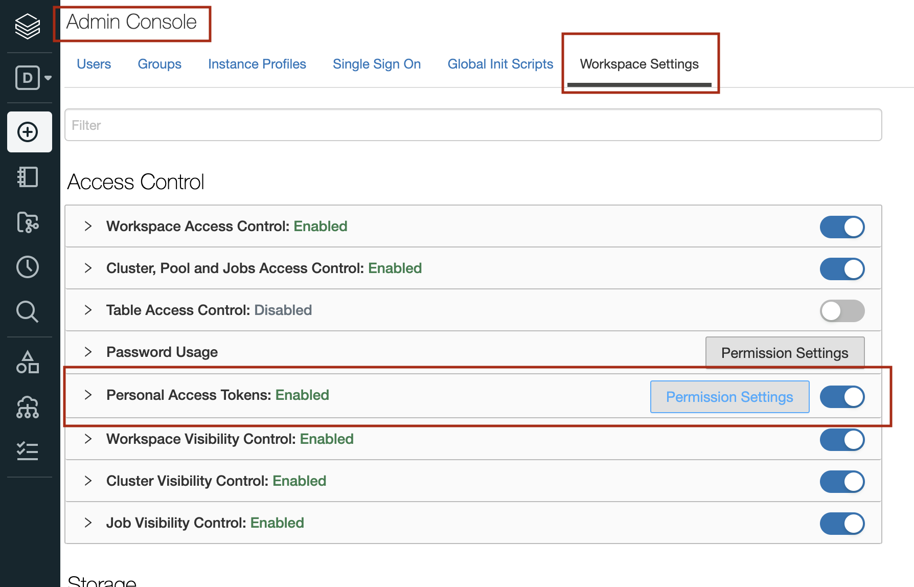
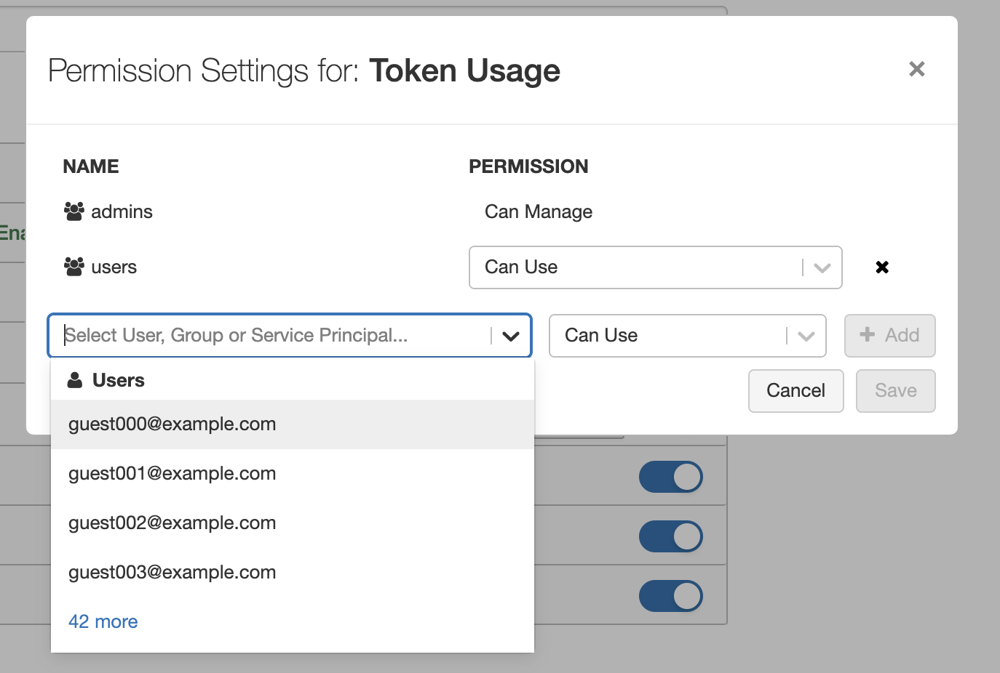

# Databricks CLIおよびSecretsの使い方

DatabricksのNotebook上でパスワードやシークレットキーなどを使用したい場合があります。
例えば、Databricks(クラスタ)からAWSアクセスキー/シークレットキーを使ってAWS S3へアクセスする場合、
Notebook上で`s3://{access_key}:{secret_key}@{s3_bucket}`のようなパスで参照できます。しかし、
そのままコードに書いて実行するとシークレットキーなどが平文で表示されてしまうため安全ではありません。

このような状況で、コード上では内容を隠蔽しつつ変数に値を提供する機能がSecretsです。
具体的には、Secretsは秘匿文字列のためのkey-valueストアです。
この記事では、DatabricksのSecretsの使用方法、アクセス制御について説明します。

また、Secretsの管理にはDatabricks CLIが必要になります。そのため、CLIのセットアップの方法も説明します。

## Secrets機能の種類

Secretsには以下の2つのバックエンドモードがあります。

|# | Backend Type   | 特徴  | 利用可能クラウド |
|--|----------------|-------|-----------------------|
|1.| Databricks     | シークレットのkey-valueはDatabricks上で管理される。ユーザーはDatabricks CLI/APIを使用してシークレットのkey-valueを登録する。(デフォルト)      | AWS, Azure, GCP      |
|2.| Azure Key Vault| シークレットのkey-valueはAzure Key Vaultで管理される。DatabricksがAzure Key Vaultとの関連付けさせて値を参照する。ユーザーはAzure Key VaultのUI上でシークレットを登録する。   | Azure

ここでは、DatabricksバックエンドのSecretsの使用・管理方法について説明します。
Azure Key VaultバックエンドのSecretsに関しては[こちら](https://docs.microsoft.com/ja-jp/azure/databricks/scenarios/store-secrets-azure-key-vault)を参照ください。

## 環境設定(Databricks CLIの準備)

Secretsの登録、削除などの管理はWeb UIでは提供されておらず、Databricks CLIもしくはAPIを経由での操作が必要になります。
ここでは、Databricks CLI(以下、CLI)を使用する例を見ていくため、セットアップしていきます。
既にCLIがセットアップ済であれば読み飛ばしてください。


### Databricks CLIのインストール

CLIはPyPIパッケージで公開されていますので、Pythonの`pip`コマンドでインストール可能です。

```bash
$ pip install databricks-cli

### 確認
$ databricks --version
Version 0.14.3

### Helpの表示
$ databricks -h

Usage: databricks [OPTIONS] COMMAND [ARGS]...

Options:
  -v, --version   0.14.3
  --debug         Debug Mode. Shows full stack trace on error.
  --profile TEXT  CLI connection profile to use. The default profile is
                  "DEFAULT".
  -h, --help      Show this message and exit.

Commands:
  cluster-policies  Utility to interact with Databricks cluster policies.
  clusters          Utility to interact with Databricks clusters.
  configure         Configures host and authentication info for the CLI.
  fs                Utility to interact with DBFS.
  groups            Utility to interact with Databricks groups.
  instance-pools    Utility to interact with Databricks instance pools.
  jobs              Utility to interact with jobs.
  libraries         Utility to interact with libraries.
  pipelines         Utility to interact with the Databricks Delta Pipelines.
  runs              Utility to interact with the jobs runs.
  secrets           Utility to interact with Databricks secret API.
  stack             [Beta] Utility to deploy and download Databricks resource
                    stacks.
  tokens            Utility to interact with Databricks tokens.
  workspace         Utility to interact with the Databricks workspace.

```

システム要件についての詳細は[こちら](https://docs.databricks.com/dev-tools/cli/index.html)を参照ください。


### Tokenの準備

CLIの認証にはPersonal Access Token(PAT,　以下Token)を使用します(Databricks Workspaceのログインユーザー名、パスワードでの認証も可能ですが、パスワードが平文で設定ファイル内に記載されるため安全ではなく非推奨です)。CLIコマンドは、このTokenに紐づくユーザーの権限に基づいて実行されます。

Tokenは各ユーザーがDatabricksのWorkspace上から発行可能です。

#### 一般ユーザー向けのToken機能の有効化
Workspaceの初期状態ではAdminユーザー以外はTokenの発行が無効(不可能)になっているため、一般ユーザーでTokenを利用するには、以下の通り機能の有効化が必要になります。

(AdminユーザーのみのToken発行を許可し、一般ユーザーのToken発行が不要な場合はここで説明している作業は不要です。)

1. Admin権限を持つユーザーでWorkspaceにログインします。
2. 左メニューの下部にある `Settings` から `Admin Console`を選択します。
3. `Admin Console`の上部の`Workspace Settings`タブ内の`Personal Access Token`を`ON`に設定します。
  - 
4. 上記で表示される`Permission Settings`ボタンをクリックし、Tokenを有効化するユーザー・グループを指定します。
  - 

以上で、Adminユーザー以外の一般ユーザーについてもTokenが発行できるようになりました。


#### Tokenの発行

1. Tokenを発行するユーザーアカウントでWorkspaceにログインします。
2. 左メニュー下部の`Settings`から`User Settings`を選択します。
3. `User Settings`の上部の`Access Token`タブ内にある`Generate New Token`ボタンをクリックします。
4. Token名と有効期限を入力し`Generate`ボタンをクリックします。
5. Token文字列のウィンドウが開きますので、Tokenをコピーして、別の場所に記録しておきます(Token文字列がが参照できるのは唯一この時だけになります)。

以上でTokenの発行ができました。


### クレデンシャルファイルの作成

最後に、上記で発行したTokenとWorkspace URLをCLIに登録します。

```bash
$ databricks configure --Token
Databricks Host (should begin with https://):  <=== "Workspace URLを入力。例えば`https://xxxxx.cloud.databricks.com`など"
Token:   <=== 上記のToken文字列を入力
```

上記のコマンドにより`~/.databrickscfg`ファイルが作成されます。

```bash
$ less ~/.databrickscfg

[DEFAULT]
host = https://xxxxx.cloud.databricks.com
Token = xxxxxxxxxxxxxxxxxxx
```
上記の`[DEFAULT]`部分はProfile名になります。
一般的なクレデンシャルファイルと同様にProfile名を分けて、複数のWorkspace/Tokenを含めることができます。

上記のクレデンシャルが正しく機能するか確認するために適当なCLIコマンドを実行してみます。
```bash
$ databricks workspace ls 
Repos
Users
Shared
```

エラーなく実行できれば問題ありません。
以上でCLIの設定は完了しました。


## Secretsの作成

SecretsはScopeを作成し、そのScope内に複数のシークレットkey-valueを登録して使用します。
このScopeがアクセス制限の基本単位になっています。

ここで、Databricks(クラスタ)からAWSのS3へのアクセスについて、AWSアクセスキー/シークレットキーを用いて実施するケースを例にとり、これらのキー情報をSecretsを使って管理、使用する方法を見ていきます。

以下の設定を仮定します。

* AWSアクセスキー : `ACCESSKEY123ABCDEFG`
* AWSシークレットキー : `ABCsecretkey/foobar123`
* S3 Bucket名: `example-s3-bucket`

また、SecretsのScope名、Key名は以下のものを使用します。

* Scope: `my_aws_secrets`
  - Key #1: `my_aws_access_key` (アクセスキーを値として登録する)
  - Key #2: `my_aws_secret_key` (シークレットキーを値として登録する)


はじめに、現状の登録されているSecrets一覧を確認してみます。初期状態なので、登録されているScopeはありません。
```bash
$ databricks secrets list-scopes

Scope        Backend     KeyVault URL
-----------  ----------  --------------
```

Scope作成していきます。
```bash
$ databricks secrets create-scope --scope "my_aws_secrets"
```

続いて、key-valueを登録します。

```bash
$ databricks secrets put --scope "my_aws_secrets" --key "my_aws_access_key" --string-value "ACCESSKEY123ABCDEFG"

$ databricks secrets put --scope "my_aws_secrets" --key "my_aws_secret_key" --string-value "ABCsecretkey/foobar123" 
```

ScopeおよびKeyが登録できたか確認します。
```bash
$ databricks secrets list-scopes

Scope           Backend     KeyVault URL
--------------  ----------  --------------
my_aws_secrets  DATABRICKS  N/A


$ databricks secrets list --scope "my_aws_secrets"
Key name             Last updated
-----------------  --------------
my_aws_access_key   1632832509775
my_aws_secret_key   1632832586314
```

2つのkey-valueが登録されていることがわかります。
以上で、Secretsの登録が完了しました。


## Notebook上からのSecrets利用


Notebook上のPythonコードからSecretsの値を参照するには`dbutils.secrets.get()`を使用します。
以下が使用例になります。


```python
### (Databricks Notebook上のコード)

# AWSのAccessKey, SecretKeyを指定
access_key = dbutils.secrets.get(scope='my_aws_secrets', key='my_aws_access_key')
secret_key = dbutils.secrets.get(scope='my_aws_secrets', key='my_aws_secret_key')
encoded_secret_key = secret_key.replace("/", "%2F")

# S3のバケツを指定
s3bucket = 'example-s3-bucket'

# パスを構成する
file_path = f's3a://{access_key}:{encoded_secret_key}@{s3bucket}/'

### アクセス(S3上のファイルをlistする)
display( dbutils.fs.ls(file_path) )
```

また、コード上でSecretsの値を持つ変数を表示出力すると`[REDACTED]`となり、表示上隠蔽されます。
```python
print(access_key)

[REDACTED]
```

## Secretsの削除

Secretsの削除もCLIから実施します。

```bash
### Scope内の特定のkey-valueの削除
$ databricks secrets delete  --scope "my_aws_secrets" --key "my_aws_access_key"

### Scope自体の削除
$ databricks secrets delete-scope --scope "my_aws_secrets"
```

その他Secrets操作に関してはSecrets CLIのhelpを参照ください。

```bash
$ databricks secrets -h

Usage: databricks secrets [OPTIONS] COMMAND [ARGS]...

  Utility to interact with secret API.

Options:
  -v, --version   0.14.3
  --debug         Debug Mode. Shows full stack trace on error.
  --profile TEXT  CLI connection profile to use. The default profile is
                  "DEFAULT".
  -h, --help      Show this message and exit.

Commands:
  create-scope  Creates a secret scope.
  delete        Deletes a secret.
  delete-acl    Deletes an access control rule for a principal.
  delete-scope  Deletes a secret scope.
  get-acl       Gets the details for an access control rule.
  list          Lists all the secrets in a scope.
  list-acls     Lists all access control rules for a given secret scope.
  list-scopes   Lists all secret scopes.
  put           Puts a secret in a scope. "write" is an alias for "put".
  put-acl       Creates or overwrites an access control rule for a principal
                applied to a given secret scope. "write-acl" is an alias for
                "put-acl".
  write         Puts a secret in a scope. "write" is an alias for "put".
  write-acl     Creates or overwrites an access control rule for a principal
                applied to a given secret scope. "write-acl" is an alias for
                "put-acl".

```

## Secretsのアクセス制御

**注意:**　本機能はPremium, Enterpriseプランでのみ利用できます。

Secretsはユーザー間・グループ内で共有可能です。ただしデフォルトでは作成したユーザー、およびAdminユーザーのみが参照できる状態になっています。ここでは、アクセス制御の方法について説明します。

アクセス権限に関しては以下の3種類が定義されています。

|権限| Scope ACL変更 | Scopeの作成・削除 | Scope内のkey-valueの作成・削除| Scope内のkey-valueの参照 |
|----|:----------:|:-------------:|:-:|:-:|
| `MANAGE` |    X    |       X           |          X              |               X                      |
| `WRITE`  |         |                   |          X              |              X                        |
| `READ`   |         |                   |                         |               X                       |

AdminユーザーはすべてのSecrets Scopeについて`MANAGE`権限が与えられます。
一方、一般ユーザーに関しては、Scopeを作成したユーザーに`MANAGE`権限が付与され、それ以外の一般ユーザーについてはアクセス権限は付与されません。
つまり、デフォルトでは、一般ユーザーは他のユーザーが作成したScopeには参照できないようになっています。

他のユーザーやグループにSecretsのアクセス許可を与える例を見ていきましょう。

```bash
### ユーザー"user001@example.com"に`MANAGE`権限を付与する
$ databricks secrets put-acl --scope "my_aws_secrets" --principal user001@example.com --permission MANAGE

### グループ"team_abc123"に対して`READ`権限を付与する
$ databricks secrets put-acl --scope "my_aws_secrets" --principal team_abc123 --permission READ

### 現在のアクセス権限を確認する
$ databricks　secrets list-acls --scope "my_aws_secrets"

Principal             Permission
--------------------  ------------
team_abc123           READ
user001@example.com   MANAGE
me@example.com        MANAGE  <== Scope作成ユーザーはデフォルトで`MANAGE`が付与
```

これで、ユーザー`user001@example.com`やグループ`team_abc123`のメンバーユーザーがSecrets `my_aws_secrets`を参照できるようになります。
また、ユーザー`user001@example.com`はこのSecrets `my_aws_secrets`の作成ユーザーと同等の権限が付与され、Secretsを管理が可能になります。

## 制限

Secretsについて以下の制限があります。

* WorkspaceあたりのScope数の上限: `100`
* 各Scope内に登録できるSecrets数の上限: `1000`
* シークレット(value)の最大サイズ: `128 KB`


## 参考

* [シークレットの管理](https://docs.microsoft.com/ja-jp/azure/databricks/security/secrets/)