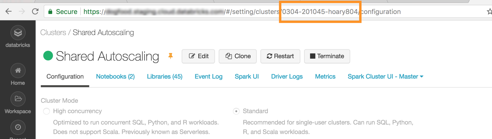
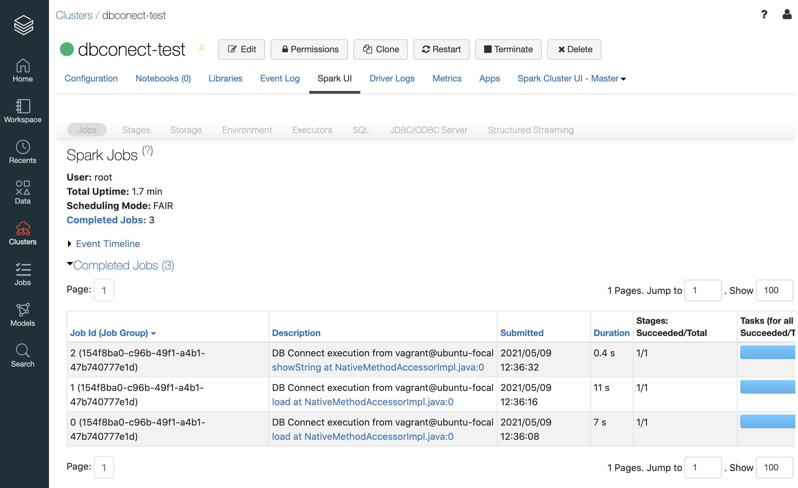

# Databrciks Connectによる外部コードからのDatabricksクラスタ利用

このドキュメントでは、Databricks Connectを使って、外部にあるコード、例えばPCローカルにあるSparkのコードをdatabricksのクラスタ上で実行する方法について解説します。

## 1. クラスタ実行環境の確認

Databricks ConnectはクラスタのRuntimeのversionおよび対応するPythonのversionの組み合わせが限定されています。よって、[このドキュメント](https://docs.microsoft.com/ja-jp/azure/databricks/dev-tools/databricks-connect#requirements)を参照して、コードを実行するクラスタのRuntime versionに合わせてPythonの環境を準備する必要があります。

このドキュメントでは以下の環境を想定した実行例を見ていきます。

* Databrciks Runtime: 8.1 ML
* Python: 3.8.0
* コマンドを実行する環境(Sparkのコードが配置される): Ubuntu 20.04(ローカルPC)

また、上記の`databricks-connect`コマンドを実行する環境には`Java Runtime Environment (JRE) 8`が必要になります。`Java 11`はサポートされていません。


## 2. Databricks Connectのインストール

Databrick Connectは`pip`からインストールできます。

```bash
### JVM v8が利用可能か確認
$ java -version
openjdk version "1.8.0_292"
OpenJDK Runtime Environment (build 1.8.0_292-8u292-b10-0ubuntu1~20.04-b10)
OpenJDK 64-Bit Server VM (build 25.292-b10, mixed mode)


### Pythonのversion確認
$ python --version
Python 3.8.0

### Databricks Connectのインストール
$ pip install -U databricks-connect==8.1

### 確認
$ databricks-connect -h
usage: databricks-connect [-h] {configure,test,get-jar-dir,get-spark-home}

positional arguments:
  {configure,test,get-jar-dir,get-spark-home}

optional arguments:
  -h, --help            show this help message and exit
```

これでインストールが完了しました。

## 3. 環境設定

Databricks connectで接続するための以下の情報を集めます。

* WorkpaceのURL
* User Access Token
* クラスターID

それぞれ見ていきます。

### WorkspaceのURL

WorkspaceのURLはブラウザでアクセスする場合のURLになります。
スクリーンショットの例では以下の通りになります。

* Workpace URL: `https://adb-2683919233495112.12.azuredatabricks.net`
* Organization ID: `2683919233495112`


### User Access Token

Databrciksのワークスペース右上にあるユーザー設定アイコンから`User Settings`をクリックします。
その後、`Access Token`タブ内にある`Generate New Token`からトークンを発行します。

* User Access Token: `発行したトークン文字列`


### クラスターID

Databricksのワークスペースの左にある`Clusters`メニューから、実行するクラスタを選択します。
その際のブラウザのアドレスバーに表示されるURLから下記の通りクラスターIDを確認できます。

* ClusterID: `0304-201045-xxxxxxxx`




### databricks-connectのconfigure

最後に、上記の情報をconfigureで設定します。

```bash
$ databricks-connect configure

### インタラクティブに入力する
```

上記の設定が完了すると、ユーザーのホームディレクトリ内に`~/.databricks-connect`が作成され、その中に設定値が書き込まれます。


## 4.接続テスト

接続テスト用に`test`コマンドが用意されています。
実行して接続に問題ないかを確認します。

```bash
$ databricks-connect test


* PySpark is installed at /.../3.5.6/lib/python3.5/site-packages/pyspark
* Checking java version
java version "1.8.0_152"
Java(TM) SE Runtime Environment (build 1.8.0_152-b16)
Java HotSpot(TM) 64-Bit Server VM (build 25.152-b16, mixed mode)
* Testing scala command
18/12/10 16:38:44 WARN NativeCodeLoader: Unable to load native-hadoop library for your platform... using builtin-java classes where applicable
Using Spark's default log4j profile: org/apache/spark/log4j-defaults.properties
Setting default log level to "WARN".
To adjust logging level use sc.setLogLevel(newLevel). For SparkR, use setLogLevel(newLevel).
18/12/10 16:38:50 WARN MetricsSystem: Using default name SparkStatusTracker for source because neither spark.metrics.namespace nor spark.app.id is set.
18/12/10 16:39:53 WARN SparkServiceRPCClient: Now tracking server state for 5abb7c7e-df8e-4290-947c-c9a38601024e, invalidating prev state
18/12/10 16:39:59 WARN SparkServiceRPCClient: Syncing 129 files (176036 bytes) took 3003 ms
Welcome to
      ____              __
     / __/__  ___ _____/ /__
    _\ \/ _ \/ _ `/ __/  '_/
/___/ .__/\_,_/_/ /_/\_\   version 2.4.0-SNAPSHOT
...
...
...
(いろいろ続く)
```

## 5. ローカルのSparkコードをDatabricksクラスタ上で実行する

問題なければ以下のコードをローカル上で実行するとDatabricksクラスタ上でspark処理が実行されます。

サンプルコード: `dbc-example.py`
```python
from pyspark.sql import SparkSession
spark = SparkSession.builder.getOrCreate()

df = (
    spark
    .read
    .format('csv')
    .option('Header', True)
    .option('inferSchema', True)
    .load('/databricks-datasets/flights/departuredelays.csv')
    )

print( df.printSchema() )
print( df.show(5) )
```

上記のコードを実行。

```bash
$ python dbc-example.py 

21/05/09 12:35:13 WARN Utils: Your hostname, ubuntu-focal resolves to a loopback address: 127.0.1.1; using 10.0.2.15 instead (on interface enp0s3)
21/05/09 12:35:13 WARN Utils: Set SPARK_LOCAL_IP if you need to bind to another address
21/05/09 12:35:14 WARN NativeCodeLoader: Unable to load native-hadoop library for your platform... using builtin-java classes where applicable
Using Spark's default log4j profile: org/apache/spark/log4j-defaults.properties
Setting default log level to "WARN".
To adjust logging level use sc.setLogLevel(newLevel). For SparkR, use setLogLevel(newLevel).
21/05/09 12:35:15 WARN MetricsSystem: Using default name SparkStatusTracker for source because neither spark.metrics.namespace nor spark.app.id is set.
root
 |-- date: integer (nullable = true)
 |-- delay: integer (nullable = true)
 |-- distance: integer (nullable = true)
 |-- origin: string (nullable = true)
 |-- destination: string (nullable = true)

None
View job details at https://japan-sa.cloud.databricks.com/?o=3762993952398646#/setting/clusters/0430-081806-waled253/sparkUi
+-------+-----+--------+------+-----------+
|   date|delay|distance|origin|destination|
+-------+-----+--------+------+-----------+
|1011245|    6|     602|   ABE|        ATL|
|1020600|   -8|     369|   ABE|        DTW|
|1021245|   -2|     602|   ABE|        ATL|
|1020605|   -4|     602|   ABE|        ATL|
|1031245|   -4|     602|   ABE|        ATL|
+-------+-----+--------+------+-----------+
only showing top 5 rows

None
```

Databricks上のクラスタで実行されているため、クラスタのSpark UI上からも実行結果が確認できます。




各種IDEとの連携に関しては以下のドキュメントを参照してください。


## 参考

* [Databricks Connect](https://docs.microsoft.com/ja-jp/azure/databricks/dev-tools/databricks-connect)
