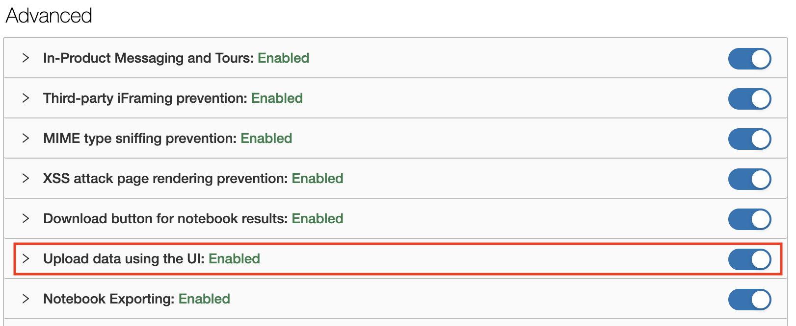
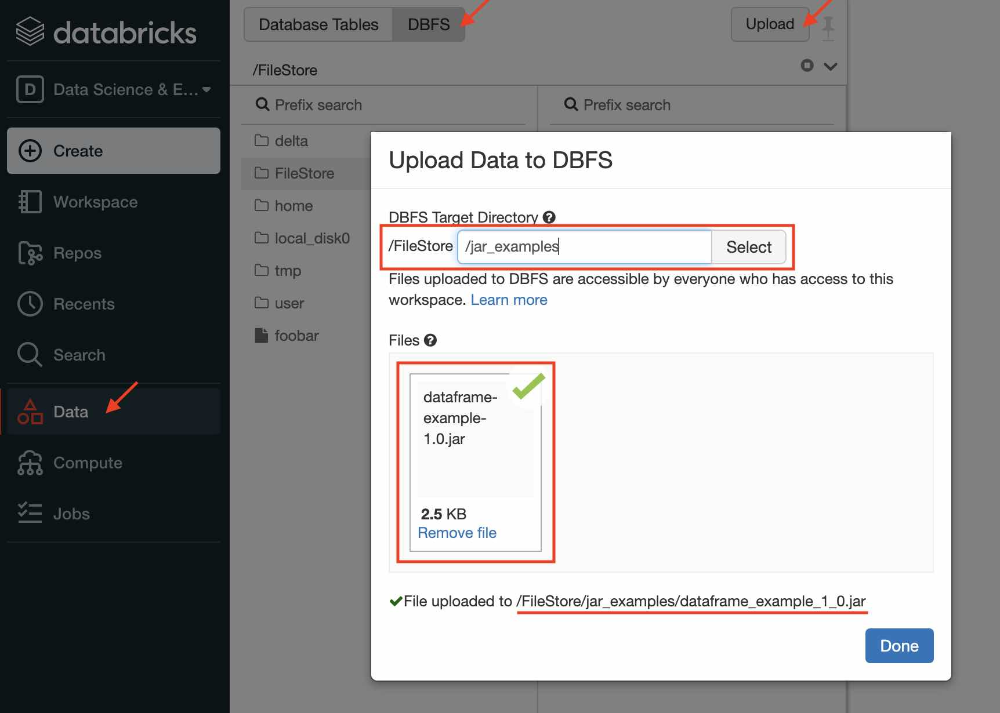
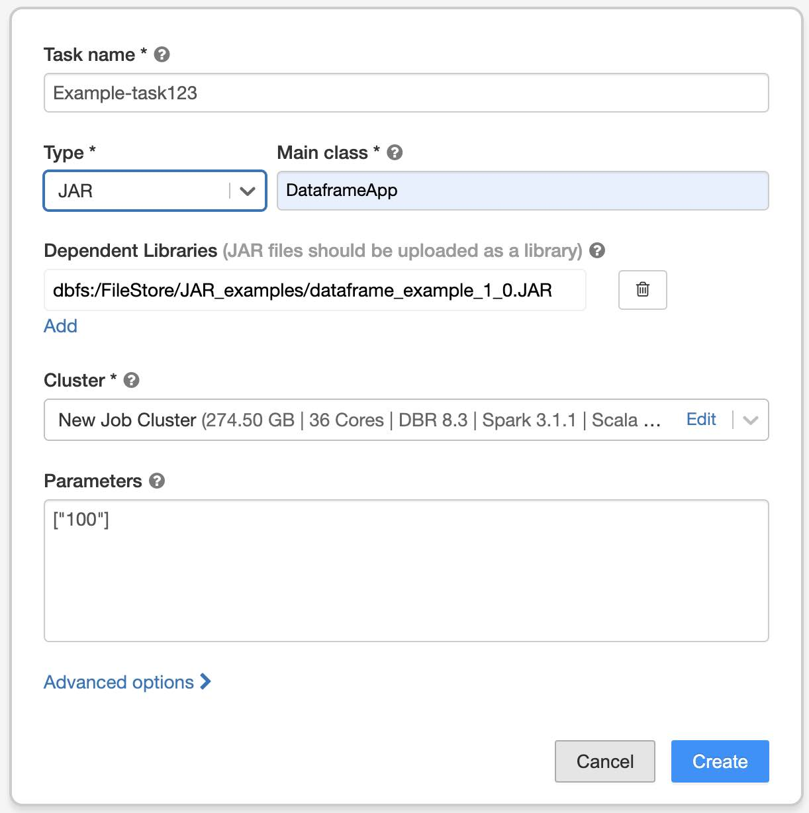
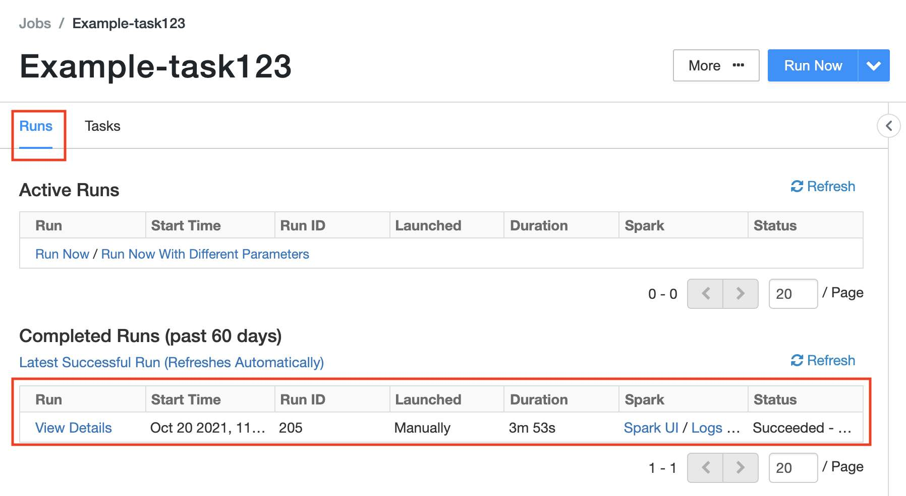

# Databricks上でのJARの実行方法

以下のステップになります。

1. JARファイルアップロードする
1. Jobの作成
1. Jobの実行と結果の確認


ここでは、前半でWeb UIを使用した方法に関して説明し、その後、CLI(コマンドライン)で実施する方法を説明します。

## 1. JARファイルのアップロード

JARをDatabricks上で実行するには、JARファイルをDBFS(DatabricksのRootストレージ、実体はWorkspaceを作成したときにS3, Blob Storage, GCS)にアップロードする必要があります。

### Upload機能の有効化の確認
まず、Web UIからファイルをアップロード機能が有効化されているか確認します。
Admin権限を持つユーザーでDatabricksのWorkspaceにログインした後、以下の通り確認できます。

1. 左バーの下部にある`Settings`(ギアのアイコン) > `Admin Console`をクリック
1. ページ遷移後に、上部にあるタブから`Workspace Settings`を選択
1. `Advanced`セクションにある`Upload data using the UI`を`ON`になっているか確認



以上で

### JARのアップロード

Databricksの左メニューから

1. `Data`を選択
1. 上部にある`DBFS`ボタンをクリック
1. その右側に現れる`Upload`ボタンをクリック
1. ポップアップするWindow内でアップロードするディレクトリを指定
1. アップロードするファイルを選択する
1. `Done`ボタンをクリック

例えば、以下の通り設定します。

* アップロード先ディレクトリ: `/FileStore/JAR_examples/`
* アップロードするファイル: `dataframe-example-1.0.JAR`

アップロード後のファイルパスは以下の通りになります。

* `dbfs:/FileStore/JAR_examples/dataframe_example_1_0.JAR`




## 2. Jobの作成

Databricksの左メニューから　

1. `Jobs`をクリックして、Job一覧ページを開く
1. `Create Job`ボタンをクリック
1. `Task`タブに現れるポップアップのWindow内にタスクの内容を設定
    - Task name: 任意の文字列(適宜)
    - Type: `JAR`
    - Main class: JARのメインクラス名
    - Depenent Libraries: 
	  + `Add`クリックして
	  + Library Source: `DBFS/S3`
	  + File Path: 先ほどアップロードしたJARファイルのパス(例: `dbfs:/FileStore/JAR_examples/dataframe_example_1_0.JAR`)
	  + `Add`をクリック
1. Cluster: Editをクリックしてクラスタの内容を設定
1. Parameters: JARに渡すパラメータ(コマンドライン引数)をJSON形式で指定する (任意)
1. `Create`をクリック




### 3. Jobの実行と結果の確認

以下の通り、Jobの管理画面を開きます(Job作成した直後のページ)。

1. Databricksの左メニューから`Jobs`をクリック
1. Job一覧から該当のJobをクリック
1. Job設定ページに以下の2つのタブがある
    * `Runs`: 実行結果の一覧
	* `Tasks`: Jobの設定(前節で実施した内容)

Jobの設定ページの右上にある`Run Now`をクリックするとJobが実行開始されます。
実行が終了すると`Runs`タブにある一覧から結果が参照できます。Spark UI、標準/エラー出力なども参照可能です。




以上が基本的なJARの実行方法になります。


# (補足1)クラスタについて

Jobを実行する際のクラスタは以下の2種類があります。

* **Jobs Computeクラスタ(Jobsのデフォルト)**
  - バッチ処理向けのクラスタタイプ
  - Job実行される毎に起動し、実行が終了した後すぐにシャットダウンされる
  - 起動に1-2数分かかる
  - 利用単価は安価(対All Purpose Compute)
  
* **All Purpose Computeクラスタ(Notebook実行のデフォルト)**
  - インタラクティブ作業向けのクラスタタイプ
  - 起動、シャットダウンはユーザーが実施する(idle時のオートシャットダウンの機能あり)
  - 連続起動しているため、すぐにJobの実行が可能
  - 利用単価は高価(対Jobs Compute)
  
本番運用時のバッチ処理ではJobs Computeクラスタが適していますが、開発時などの繰り返しJob実行する場合にはAll Purposeクラスタを使用することで効率化できます。

All Purposeクラスタの設定は、Databricksの左メニュー内の`Compute`で実施します。

# (補足2) DBFSとS3 Bucketの対応について

上記で使用したDBFSストレージの実体はWorkspace作成時に登録したS3 Bucketです。
DBFS上のファイルパスとS3上のファイルパスの対応は以下の通りになっています。

| システム | file path |
| ------ | -----|
| DBFS上 | `dbfs:/FileStore/example/foobar.csv` |
| S3上   | `s3://{DBFSのバケツ名}/tokyo-prod/{ワークスペースID}/FileStore/example/foobar.csv` |

また、SparkのコードからはDBFSのファイルパスは`dbfs:`を除いた`/FileStore/example/foobar.csv`でもアクセス可能です。

ファイル一覧参照については、DatabricksのUIから実施できます(左メニュー内の`Data`から`DBFS`をクリック)。


# (補足3) Javaのコードについて

DatabricksのSparkを使用する際の注意点が以下のドキュメントから参照可能です。

* Job > Best Practice > JAR ジョブ
  - https://docs.microsoft.com/ja-jp/azure/databricks/jobs#jar-jobs

以下、Job実行確認のためのサンプルコードとJARファイルになります。

```java
import org.apache.spark.sql.SparkSession;
import org.apache.spark.sql.Dataset;
import org.apache.spark.sql.Row;


public class DataframeApp {
  public static void main(String[] args){

    SparkSession spark = SparkSession
      .builder()
      .appName("Simple Daraframe Example")
      .getOrCreate();

    Dataset<Row> df = spark.read().format("csv")
      .option("inferSchema", "true")
      .option("header", "true")
      .load("/databricks-datasets/Rdatasets/data-001/csv/ggplot2/diamonds.csv");

    df.show();
    //spark.stop();
  }
}
```

* JARファイル: [`dataframe-example-1.0.jar`](https://sajpstorage.blob.core.windows.net/demo-asset-workshop2021/example/dataframe-example-1.0.jar)


# (補足4) コマンドラインからの実行について

上記で説明したJARの実行について、コマンドライン(CLI)からの実行も可能です。
以下にドキュメントがありますので、参照ください。

* [ジョブ CLI](https://docs.microsoft.com/ja-jp/azure/databricks/dev-tools/cli/jobs-cli)


-------

# 参考リンク

* [Databricks Jobs](https://docs.microsoft.com/ja-jp/azure/databricks/jobs)
