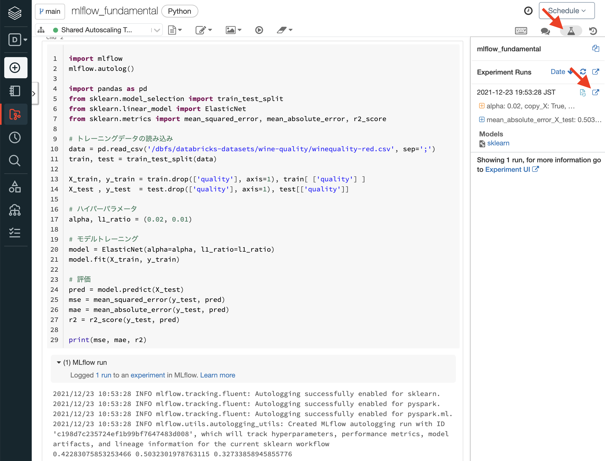
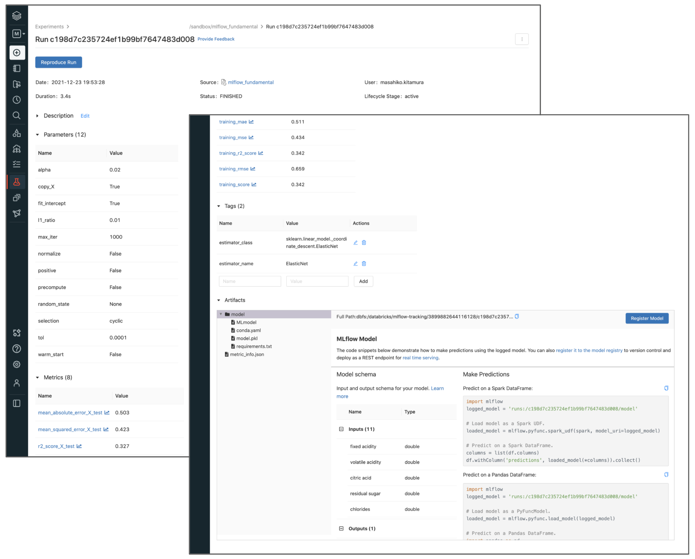
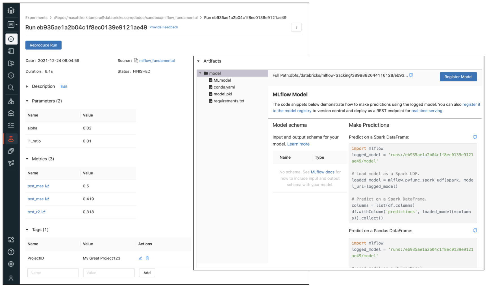
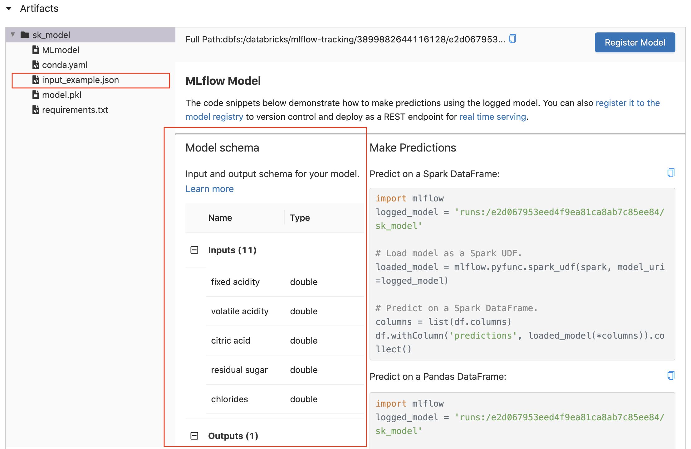

# MLflowサプリメント

こんにちは、Databricksの北村です。今回は、機械学習ライフサイクルを管理するフレームワークであるMLflowについて、実際にどのように使えるのかという視点で見ていきたいと思います。MLflow機能のウォークスルーとしても使える内容になっています。

MLflowの入門、基礎などは以下のドキュメントにまとまっておりますので参照ください。

* [Databricks MLflowガイド](https://qiita.com/taka_yayoi/items/1a4e82f7e20c56ba4f72)
* [DatabricksにおけるMLflowモデルレジストリ](https://qiita.com/taka_yayoi/items/e7a4bec6420eb7069995)
* [Databricksにおけるモデルサービング](https://qiita.com/taka_yayoi/items/b5a5f83beb4c532cf921)
* [DatabricksのMLflowを用いたモデルのログ、ロード、登録、デプロイ](https://qiita.com/taka_yayoi/items/e265d48a3e3473edd1b6)


この記事では、実際に手を動かして見ていくことを想定して進めていきます。Databricksの環境を前提に見ていきますが、MLflowはオープンソースですので、[自前で構築](https://mlflow.org/docs/latest/quickstart.html)すれば(と言っても、実質は`pip install mlflow`コマンドを叩くだけ)、同様のことが実施可能です。


## MLflow 101

MLflowを使うと何ができるのか? この質問に対する短い回答は以下の通りです。

* MLのライフサイクル管理/MLOps管理
  * modelの管理・レジストリ・レポジトリ
  * モデル学習実験の管理(モデル記録、パラメータ記録、コード記録、派生ファイル記録など、モデルトラッキング)
  * モデル間の比較
  * モデルのデプロイ・エクスポート・サービング機能

これらのポイントを実際に触っていきましょう。


## いつもの機械学習コード + MLflow(自動ログモード)

まずは、実際にMLflowってどんな感じに使えるのか、ざっくり見ていきます。
以下のコードは、例としてScikit-learnでElastic Net(線形回帰)でモデルトレーニングするケースを想定し、そこにMLflowを使ってモデル学習実験の記録・管理(トラッキング)をするコードになります。

```python
import mlflow
mlflow.autolog()

import pandas as pd
from sklearn.model_selection import train_test_split
from sklearn.linear_model import ElasticNet
from sklearn.metrics import mean_squared_error, mean_absolute_error, r2_score

# トレーニングデータの読み込み
data = pd.read_csv('/dbfs/databricks-datasets/wine-quality/winequality-red.csv', sep=';')
train, test = train_test_split(data)

X_train, y_train = train.drop(['quality'], axis=1), train[ ['quality'] ]
X_test , y_test  = test.drop(['quality'], axis=1), test[['quality']]

# ハイパーパラメータ
alpha, l1_ratio = (0.02, 0.01)

# モデルトレーニング
model = ElasticNet(alpha=alpha, l1_ratio=l1_ratio)
model.fit(X_train, y_train)

# 評価
pred = model.predict(X_test)
mse = mean_squared_error(y_test, pred)
mae = mean_absolute_error(y_test, pred)
r2 = r2_score(y_test, pred)
print(mse, mae, r2)
```

MLflowを使用しない普段のコードとの差分はどこにでしょうか?

答えは、最初の2行のみがMLflow化するために、既存の機械学習コードに追加した差分になります。
つまり、すでに手元にある既存の機械学習コードがある場合、この2行を追加すればMLflowが自動で機械学習の実験をログしてくれます。

実際に自動的に記録されたログを見て見ましょう。

DatabricksのNotebook上の右上の"Experiment"アイコンからすぐにMLflowのトラッキングUIにアクセスできます。ポップアップアイコンをクリックして、詳細ページ(Runのページ)を開きます。





上図からも分かる通り、以下の項目が自動的にトラックされます。

* 基本情報
  - 日時
  - 学習にかかった時間(Duration)
  - 実行ユーザー
  - 実行したNotebook(コード)へのリンク

* 学習に関わる情報
  - モデルのパラメータ(ハイパーパラメータも含む)
  - モデルの性能(MSEやR2など)
  - タグ(任意)

* 派生データ(Artifacts)
  - モデルのオブジェクトデータ(バイナリ)
  - その他派生のデータ(グラフなど、モデルによって異なる)
  - 実行環境再現のためのconda, pip構成ファイル
  - モデルの`predict()`が受け入れる引数のスキーマ(型情報)

もちろん、自動的にトラックされるログは機械学習ライブラリやモデル(アルゴリズム)によって異なります。自動ログに対応しているライブラリと何がトラックされるのかの詳細は[MLflowのドキュメント](https://www.mlflow.org/docs/latest/tracking.html#automatic-logging)を参照ください。


## 自動ログの内容を手動でやってみる

自動でトラックされる機能は便利である一方で、後ろで何が起きているのかわからないので、そこが知りたいと思われる方もいらっしゃると思います。自動ログをOFFにして、手動でMLflowでトラックするコードを見ていきます。自動ログ機能は途中から追加された機能で、以前はこの方式でMLflowを使うしかありませんでした。

以下がコードになります。MFflowの自動ログは`Databricks Rumtime 9.0 ML`以降でデフォルト有効になっているため、コードの最初で明示的にOFFにしています。

```python
import mlflow
mlflow.autolog(disable=True)

import pandas as pd
from sklearn.model_selection import train_test_split
from sklearn.linear_model import ElasticNet
from sklearn.metrics import mean_squared_error, mean_absolute_error, r2_score

# トレーニングデータの読み込み
data = pd.read_csv('/dbfs/databricks-datasets/wine-quality/winequality-red.csv', sep=';')
train, test = train_test_split(data)

X_train, y_train = train.drop(['quality'], axis=1), train[ ['quality'] ]
X_test , y_test  = test.drop(['quality'], axis=1), test[['quality']]


with mlflow.start_run() as run:
  # ハイパーパラメータ
  alpha, l1_ratio = (0.02, 0.01)
  
  # モデルトレーニング
  model = ElasticNet(alpha=alpha, l1_ratio=l1_ratio)
  model.fit(X_train, y_train)

  # 評価
  pred = model.predict(X_test)
  mse = mean_squared_error(y_test, pred)
  mae = mean_absolute_error(y_test, pred)
  r2 = r2_score(y_test, pred)  
  
  print(mse, mae, r2)
  
  ### mlflowでトラックする
  # ハイパーパラメータ
  mlflow.log_param('alpha', alpha)
  mlflow.log_param('l1_ratio', l1_ratio)

  # 評価指標
  mlflow.log_metric('test_mse', mse)
  mlflow.log_metric('test_mae', mae)
  mlflow.log_metric('test_r2', r2)
  
  # モデルオブジェクト
  mlflow.sklearn.log_model(model, 'model')
  
  # タグ(任意)
  mlflow.set_tag('ProjectID', 'My Great Project123')
```

見ていただければ分かる通りポイントは以下2点です。

* MLflowでトラックしたいコード部分を`with mlflow.start_run() as run:`文の中に入れる
* `mlflow`の関数を使ってパラメータをトラックする
  - `log_param()`: パラメータをログする。Key-Value Store。
  - `log_metric()`: メトリック(評価指標)をログする。Key-Value Store、ただしvalueは数値。
  - `log_model()`: モデルオブジェクトをログする。
  - `set_tag()`: タグをつける。Key-Value Store。

特に、`log_metric()`では、MLflowの中でグラフプロット機能が提供されています。機械学習モデルでGradient Decentなどを使用する場合は、epochごとの損失関数の経過などを可視化することができます。

上記のコードでログした内容をMLflowのUI上で確認して見ましょう。




また、`log_model()`では、そのモデルが受け付けるデータのスキーマ(型)やサンプルデータなども一緒にログすることができます。これを使うと、スキーマチェック(Schema Enforcement)などが可能になります。上記のコードを以下の通り変更します。

```Python
### 変更前
  # モデルオブジェクト
  mlflow.sklearn.log_model(model, 'model')


### 変更後
  # モデルオブジェクト
  from mlflow.models.signature import infer_signature
  sig = infer_signature(X_train, model.predict(X_train))
  
  mlflow.sklearn.log_model(model, 'sk_model', signature=sig, input_example=X_test.iloc[[0]])
```

MLflowのRunページで確認すると、モデルのスキーマとサンプルデータがログされていることがわかります。




こちらは、自分で記録したいデータを任意で追加できます。
例えば上記のコードではこの実験のタグとして`ProjectID: My Great Project123`というタグを入れています。

また、上記以外にも以下のような関数が用意されています。詳しくは、[ドキュメント](https://www.mlflow.org/docs/latest/python_api/mlflow.html)を参照ください。

* `log_image()`: PILオブジェクト、numpy.arrayなどを画像ファイルとしてログする。
* `log_figure()`: Matplotlib, plotlyなどのグラフオブジェクトをファイルとしてログする。
* `log_text()`: テキストをテキストファイルとしてログする。
* `log_artifacts()` : 任意のローカルファイルをログする。


以上がMLflowのモデルトラッキング機能になります。

## ログしたモデルをロードしてみる

それでは、トラックしたモデルはどのように使用できるのでしょうか。MLflowでは、モデルオブジェクト自体もトラックしているので、それをロードして別のコードの中で使用することが簡単にできます。例えば、以前学習したモデルをベースにさらにモデルの改善を実施するような場面では、まず学習の再現をするところから始まると思います。このようなときに、MLflowを使っていれば、すぐに以前の学習モデル・パラメータをPythonコード上にロードして、学習の再現・再実験が可能です。

ここでは、先ほどトラックしたモデルをロードして使用して見ましょう。
もう気付いているかもしれませんが、モデルをPython上でロードするためのサンプルコードはMLflowのRunのUI内で提供されいます。Artifacts内のトップディレクトリ(上図だと`sk_model`)をクリックすると、`Make Prediction`セクションにコードが表示されています。

ここをみると以下の2つのversionのコードが提供されています。

* Spark Dataframeを入力として推論・推定(predict)をする
* Pandas Dataframeを入力として推論・推定(predict)をする

Spark環境がある場合(Databricksなら当然!)、モデルで推論する処理を並列分散で一気に適用(Spark!)することができます。一方で、MLflowはローカル環境などにもモデルをロードすることができるので、Spark環境がない場合にはPandasのDataframeの方で推論・推定を実施することになると思います。

せっかくなので、両方やって見ましょう。

まずはSparkを使う方から見ていきます。

```python
import mlflow
logged_model = 'runs:/e2d067953eed4f9ea81ca8ab7c85ee84/sk_model'

# Load model as a Spark UDF.
loaded_model = mlflow.pyfunc.spark_udf(spark, model_uri=logged_model)

# Predict on a Spark DataFrame.
columns = list(df.columns)
df.withColumn('predictions', loaded_model(*columns)).collect()
```


続いて、Pandas Dataframeを使う方もみましょう。

```python
import mlflow
logged_model = 'runs:/e2d067953eed4f9ea81ca8ab7c85ee84/sk_model'

# Load model as a PyFuncModel.
loaded_model = mlflow.pyfunc.load_model(logged_model)

# Predict on a Pandas DataFrame.
import pandas as pd
loaded_model.predict(pd.DataFrame(data))
```

このように、MLflowではトラックしたモデルをすぐに取り出して任意のコードで実行することがすぐに可能です。


## むすび

今回はMLflowのトラッキングの機能を中心にざっくり何ができるのかを見てきましてた。
mlflowはモデルをログした後のデプロイメントの方面でも強力な機能を持っています。
例えば、

* モデルのversion管理
* モデルサービング(REST API)
* Databricks外部(例えばローカルPCのPythonコード)からDatabricks上のMLflowにアクセス
* Dockerイメージとしてモデルをエクスポート
* SAGE Maker/Azure MLでモデルをデプロイ
* 独自モデルをMLflowのトラッキングに乗せる(カスタムのFlavorを作る)

次回はこれらの内容を掘り下げていきたいと思います。

## 参考

* [MLflow](https://mlflow.org/)