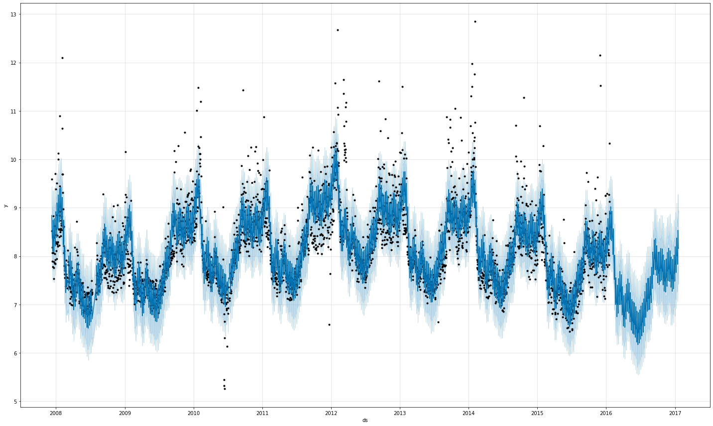
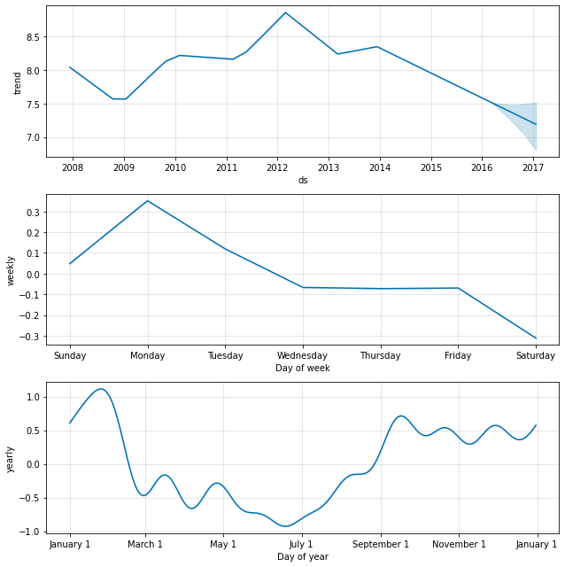

# 時系列予測ライブラリ ProphetとSparkとの連携

2021/9/15 

by Masahiko Kitamura

## 1. 時系列予測とProphet

時系列予測は周期性や季節性変動がある事象に対して予測を行います。例えば、ある商品の毎月の売り上げを考えると、商品の特性で夏に売り上が上がり、また、週末や休日前になると多く売れる、など様々な季節性、周期性要因が売り上げに関与してきます。時系列予測では、こうした季節性、周期性要因をうまくモデル化することが求められます。

[Prophet](https://facebook.github.io/prophet/)はこうした時系列予測のためのオープンソースライブラリです。Facebook社のCore Data Scienceチームが開発・リリースしており、年毎、週毎、日毎の周期性に加え、休日の影響などを考慮して非線形な傾向を持つ時系列データをシンプルにモデル化できるという特徴があります。さらに、異常値や欠損データの扱いにも強く、また、人間が理解しやすいパラメータやドメイン知識などを加えることでモデルの精度を向上させる機能も備えています。

PropehtはRおよびPythonで利用可能です。今回は、Pythonを使用したProphetの使用方法の概要とSparkと連携によりProphetをスケールさせる利用例について説明します。

## 2. Prophetの実行例と拡張性

### 2.1 ベースラインモデルの作成

Prophetの第一の特徴はシンプルに使用できる点にあります。Pythonの機械学習でよく用いられるライブラリであるScikit-learnのモデル化の手順と同等になるような関数設計になっており、`fit()`でモデルを作成し、`predict()`で予測(スコアリング)する仕様になっています。

モデル作成において、入力として使用する学習データとしては単純に以下の2つのカラムを持つDataFrameを用意します。

* `ds` : 日時もしくはタイムスタンプ
* `y` : 予測を実施する数値 (例: 商品の売り上げ数)

ここでは、Prophetのgitリポジトリに含まれるサンプルデータを使って実際のコードを見ていきます。

**注意:** 既にProphetおよびPandasライブラリが使用できるローカル環境での例になります。Databricks上での実行に関しては、後述します。

```bash
### サンプルデータのダウンロード
$ curl -O 'https://raw.githubusercontent.com/facebook/prophet/master/examples/example_wp_log_peyton_manning.csv'
```

このデータを使って、Prophetの実行例を見ていきます。

```python
import pandas as pd

### csvファイルの読み込み
p_df = pd.read_csv('example_wp_log_peyton_manning.csv')
p_df

              ds          y
0     2007-12-10   9.590761
1     2007-12-11   8.519590
2     2007-12-12   8.183677
3     2007-12-13   8.072467
4     2007-12-14   7.893572
...          ...        ...
2900  2016-01-16   7.817223
2901  2016-01-17   9.273878
2902  2016-01-18  10.333775
2903  2016-01-19   9.125871
2904  2016-01-20   8.891374

```

上記の通り、読み込んだデータは、`ds`カラムに日時、`y`カラムにターゲットとなる数値で構成されています。このデータについて、モデルを作成し、1年先までの予測する例を見ていきます。

先述のとおり、ProphetはScilit-learnと同等の手順でモデル化ができるようになっています。
そのためモデルのトレーニングには`fit()`を使用し、予測には`predict()`を使用します。

```python
from prophet import Prophet

m = Prophet() # インスタンス作成
m.fit(df) # モデルの学習
future = m.make_future_dataframe(periods=365) # 1年先までの日時がdsカラムに入っているDataFrameを用意する(予測データを入れるハコを作る)
forecast = m.predict(future) # 予測する

fig1 = m.plot(forecast, figsize=(20, 12)) # 結果のプロット#1
fig2 = m.plot_components(forecast) # 結果のプロット#2
```

* `fig1`: 青い実線、ライトブルーの領域、黒い点がそれぞれ推定値(`yhat`)、80%信頼区間(`yhat_upper, yhat_lower`)、実値(トレーニングデータ)を表しています。2016/01/20以降、1年間の部分が予測期間になっています。
  - 

* `fig2`: 予測した結果の要素(トレンド項、weekly/yearlyの季節性要素)を示しています。
  - 


上記のコードのみで時系列のモデル作成、および、予測が実現可能です。もちろんデフォルトのパラメータでモデル化を実施しているため、精度を高めるにはパラメータチューニングが必要になりますが、ベースラインとしては非常にシンプルなコードのみで時系列予測ができることがわかります。

### 2.2 モデルのカスタム化

#### 休日の設定
それでは、ここからモデル作成時に利用できる拡張性を見ていきます。

まず、一般的な季節性要因として考えられる大きな要素として「休日」が挙げられます。例えば、食品関係の売り上げ予測であれば、年間の季節性に加えて、休日が売り上げが上がる/下がるなどの大きな要因になるのは容易に想像できます。Prophetでは、この「休日」を考慮に入れたモデルを作成することが容易に可能です。

まずは、休日を表すDataFrame(`holidays`)を作成します。DataFrameの要素として、`holiday`カラムに休日の名前(この例で言えば`jp_holiday`)、`ds`カラムに休日の日時で構成します。注意点としては、学習データ機関に加えて、予測する期間の休日も含める必要があります。

```python
holidays = pd.DataFrame({
  'holiday': 'jp_holiday',
  'ds': pd.to_datetime(['2008-01-01', '2008-01-08', '2008-02-11',
                        '2008-02-12', '2008-03-21', '2008-04-29',
                        ...
                        ... (省略)
                        ...
                        '2019-09-23', '2019-09-24', '2019-10-08',
                        '2019-11-03', '2019-11-23', '2019-12-23',
                        '2019-12-24']),
})

holidays
          holiday         ds
0      jp_holiday 2008-01-01
1      jp_holiday 2008-01-08
2      jp_holiday 2008-02-11
3      jp_holiday 2008-02-12
...
xxxx   jp_holiday 2019-11-23
xxxx   jp_holiday 2019-12-23
xxxx   jp_holiday 2019-12-24
```

休日のDataFrameが構成できたら、Prophetのインスタンスを作成する際にオプションとして指定します。
それ以外は先ほどの実行例と同じコードになります。

```python
m = Prophet(holidays=holidays) # オプションで休日を指定
m.fit(df)
future = m.make_future_dataframe(periods=365)
forecast = m.predict(future)
```


### 季節性の周期指定

モデル化する現象の周期性が確定、もしくは、明らかな場合は、オプションで指定できます。
例えば、2週間ごと(14日周期)に変動を繰り返すような場合は、以下のようなコードになります。

```python
# 14日周期の現象をモデル化する
m = Prophet(weekly_seasonality=False)
m.add_seasonality(name='biweekly', period=14, fourier_order=5)
forecast = m.fit(df).predict(future)
```

### 信頼性区間(Uncertainty Intervals)の変更

Prophetは時系列予測の際に、確率分布を仮定して最尤推定によりモデルを学習していきます。そのため、予測結果に関しても、一つの値が出力されるのではなく、確率分布の中央値(最大の確率をとる値, `yhat`)に加えて、確率=80%の区間(信頼性区間, `yhat_upper, yhat_lower`)が出力されます。この信頼性区間はオプションで変更可能です。例えば、信頼性区間を95%にするには以下のコードになります。

```python
m = Prophet(interval_width=0.95)
m.fit(df)
future = m.make_future_dataframe(periods=365) 
forecast = m.predict(future)
```

### その他のパラメータ、拡張可能な項目

Prophetは上記以外の要素に関して、例えば以下の項目についてチューニング可能になっています。

* 収束上限値が分かっている場合のモデル
* トレンドの変化点への追随感度
* 信頼性区間のサンプリング方法
* 他の要素に依存する季節性の対応
* 異常値の対応
* 1日より細かい粒度の時系列データの予測
* Cross Validationによるハイパーパラメータチューニング

詳細は[公式ドキュメント](https://facebook.github.io/prophet/docs/)を参照ください。

## 3. Databricks上でのProphetの利用とSparkとの連携

### インストール

DatabricksのデフォルトのランタイムにはProphetは含まれていません。そのため、Databricks上でProphetを利用するには、別途インストールが必要です。Databricks上でのライブラリの導入には以下の3通りの方式があります。

1. [Workspace範囲のライブラリ](https://docs.microsoft.com/ja-jp/azure/databricks/libraries/workspace-libraries): Workspace内の全てのクラスタに適用されるライブラリ環境。`Workspace`ディレクトリ上からライブラリの設定が可能
1. [Cluster範囲のライブラリ](https://docs.microsoft.com/ja-jp/azure/databricks/libraries/cluster-libraries): クラスタ毎にライブラリ環境が分離。Cluster管理画面から`Libraries`メニューでライブラリを追加可能。
1. [Notebook範囲のライブラリ](https://docs.microsoft.com/ja-jp/azure/databricks/libraries/notebooks-python-libraries): Notebook毎にライブラリ環境が分離。notebook上で`%pip`コマンドなどでライブラリを追加可能。

ここではNotebook範囲でProphetをインストールするには以下のコマンドをNotebook上で実行します(その他の方式でもほぼ同様にインストールできます)。

```python
%pip install pystan==2.19.1.1

%pip install prophet
```
これで、このNotebook上でProphetが利用できるようになります。上記で説明したコーデもそのまま動作します。

### Sparkとの連携

Databricksの最大のメリットはSparkを利用したクラスタ上での分散並列実行になります。上記の例では単に一つの時系列データのモデル化・推定を実施している最もシンプルな場合のコードになりますが、実際の現場で使用するには色々な工夫が必要になります。

例えば、ある商品の売り上げを予想するモデルを作成する場面を考えてみましょう。
商品の売り上げは、

* 商品の売られている場所、販売チャネル、店舗の立地
* 商品のバリエーション、サイズ

など様々な要素に依存して変化する事は容易に想像できます。そのため、高精度に予測するには、それぞれの場合に分けて予測モデルを作成する必要が出てきます。そして、この場合の数は上記の要素の掛け算になるため非常に多くのモデル学習が必要になります。通常のシングルコンピュート環境ではモデル学習・推定が現実的な時間内で不可能な状況が往々にして発生します。

こうした状況ではProphetをSparkと連携させる事で、問題を解消できます。具体的には、過去の売り上げデータをSparkのDataFrameにロードし、Prophetのモデル学習・推定をユーザー定義関数(UDF)化することで、並列分散化が可能になります。
ここでは実際のコードに関しては解説しませんが、詳細については以下の記事、および、それに含まれるNotebookを参照ください。

* [Facebook Prophet と Apache Spark による高精度で大規模な時系列予測・分析とは](https://databricks.com/jp/blog/2020/01/27/time-series-forecasting-prophet-spark.html)


