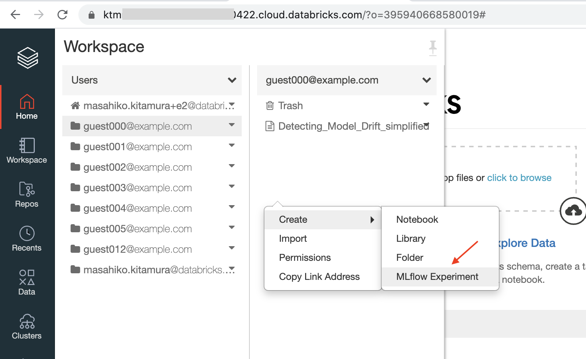
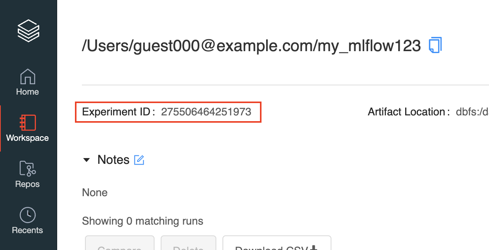
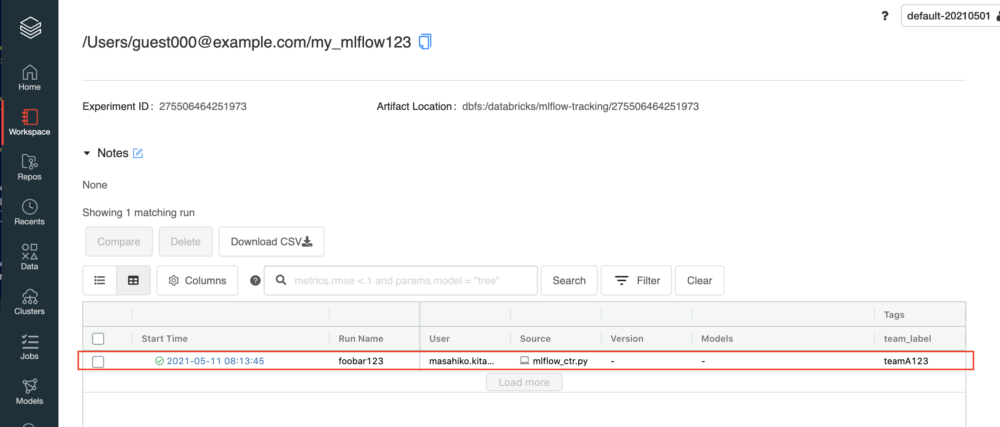

外部からDatabricks上のMLflowを使用する
======

Databricksの外部環境(ローカルPC上など)からワークスペース内のMLflowを使用する方法について説明します。

以下のステップで実行していきます。

1. DatabricksワークスペースにMLflowのexperimentを作成する
1. Databricks上のMLflowにアクセスするための情報確認
1. 外部環境からMLflowのコードを実行する(runを実行する)
1. Databricks上のMLflowページからrunの結果を確認する

## 1. DatabricksワークスペースにMLflowのexperimentを作成する

Databricksのワークスペース内に今回使用するMLflowのExperimentを作成します。
"Home"または"Workspace"アイコンからNotebookディレクトリを開き、右クリックメニューから`Create > MLflow Experiment`で作成できます。



作成されたMLflow ExperimentのページからExperiment IDを確認します。
この例では以下の通りです。

* `Experiment ID: 275506464251973`



## 2. Databricks上のMLflowにアクセスするための情報確認

外部からDatabricks上のMLflowを参照するには以下の情報が必要になります。

* ワークスペースのURL
  - ワークスペースURLはブラウザのアドレスバーから確認できます。
  - (例: `https://ktmxxxxxxxxxxxxxxxx422.cloud.databricks.com/`)
* User Access Token
  - ワークスペースの右上にある"User Settings"からトークンを発行してください。

## 3. 外部環境からMLflowのコードを実行する(runを実行する)

外部環境(ローカルPCなど)からMLflowを実行します。
ここでは、Linux環境で実行する例を見ていきます。
MLflowをインストールし、アクセスするための環境変数を設定します。

```bash
$ pip install mlflow

### インストールされたversion確認
$ mlflow --version
mlflow, version 1.17.0

### 環境変数を設定
export MLFLOW_TRACKING_URI='databricks' <= 固定
export DATABRICKS_HOST='https://ktmxxxxxxxxxxxxxxxx422.cloud.databricks.com/'
export DATABRICKS_TOKEN='dapi632xxxxxxxxxxxxxxxxxxxxxxx' <=発行したToken
```

簡単なMLflowコードを実行します。

サンプル:`mlflow_ctr.py` 
```python
import mlflow

with mlflow.start_run(run_name='foobar123', experiment_id='275506464251973') as run:
    mlflow.set_tag('team_label', 'teamA123')
```

実行します。

```bash
$ python mlflow_ctr.py
```


## 4. Databricks上のMLflowページからrunの結果を確認する

再びDatabricks上のMLflow Experimentページを参照します。
上記で実行したrunの情報が登録されていることが確認できます。




## 参考

* [MLflow Documentation](https://www.mlflow.org/docs/latest/index.html)
* [MLflow ガイド](https://docs.microsoft.com/ja-jp/azure/databricks/applications/mlflow/)
